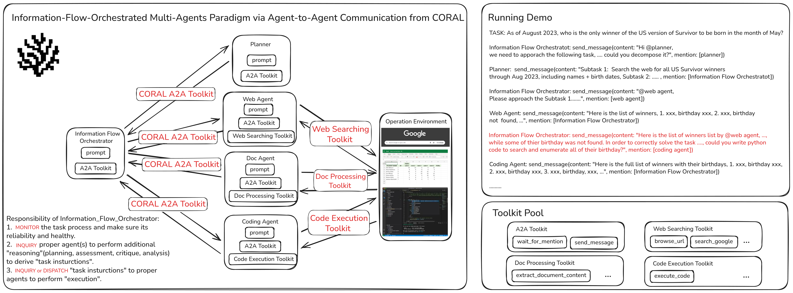

# Beyond Rule-Based Workflows: An Information-Flow-Orchestrated Multi-Agents Paradigm via Agent-to-Agent Communication

Most existing LLM-based multi-agent systems (MAS) are built on **predefined workflows**, where engineers manually enumerate task states and specify routing rules in advance.
Such workflow-driven designs essentially form **rule-based decision trees**, which are brittle, labor-intensive to design, and incapable of exhaustively covering complex real-world task states.

This repository introduces an **Information-Flow-Orchestrated Multi-Agent Paradigm** based on **Agent-to-Agent (A2A) communication from CORAL**.
Instead of relying on predefined workflows, a dedicated **information flow orchestrator** continuously monitors task progress and dynamically coordinates other agents via natural-language A2A communication.

<p align="center">
  
</p>

### Key Features

* 🚫 **Workflow-free coordination** — no predefined decision trees or routing rules
* 🔄 **Dynamic task monitoring** via a centralized information flow orchestrator
* 🧠 **Natural-language A2A communication** for flexible agent collaboration
* 🧩 **Robust handling of edge cases** in complex tasks

### Evaluation

We evaluate the proposed paradigm on the **GAIA benchmark**, using the representative workflow-based MAS **OWL** as the baseline while controlling for agent roles and underlying models.

* **Pass@1 Accuracy**: **63.64%** (vs. OWL’s **55.15%**, +8.49%)
* **Token Consumption**: Nearly identical to OWL
* **Qualitative Results**: More flexible task monitoring and improved robustness in edge-case scenarios

<p align="center">
  
</p>


# 🧪 Evaluation in GAIA

Set up environment variables:

```
echo '
export FIRECRAWL_API_KEY="your_firecrawl_api_key"
export GOOGLE_API_KEY="your_google_api_key"
export HF_HOME="your_hf_home_path"
export OPENROUTER_API_KEY="your_openrouter_api_key"
export OPENAI_API_KEY="your_openai_api_key"
export SEARCH_ENGINE_ID="your_search_engine_id"
export CHUNKR_API_KEY="your_chunkr_api_key"
' >> ~/.bashrc && source ~/.bashrc
```

Create environment:

```
cd agent_defined_workflow
/usr/bin/python3.12 -m venv venv
source venv/bin/activate
pip install -r requirements.txt
```

We made some minor modifications to CAMEL 0.2.70 for our experiments:

```
cd agent_defined_workflow
rm -rf venv/lib/python3.12/site-packages/camel
cp -r utils/camel venv/lib/python3.12/site-packages/
```

Run the experiment:

```
cd agent_defined_workflow
./run.sh
```
